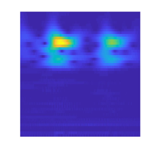
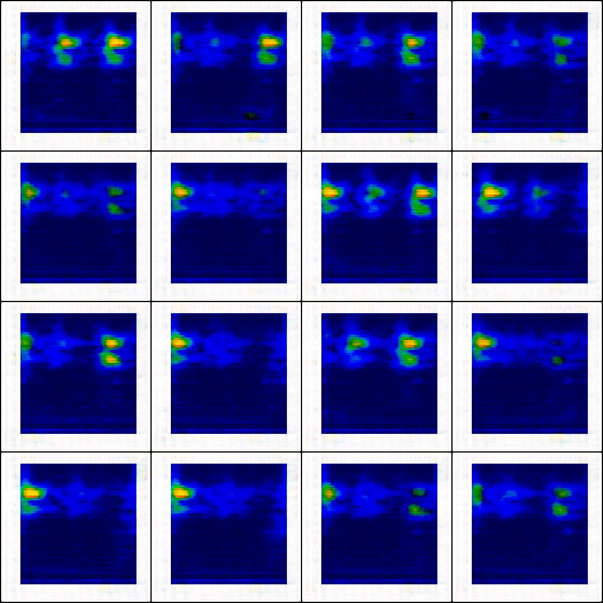

# 振动信号生成
## 数据
  
振动信号(256×256×3)  
## 模型
- DCGAN (standard GAN | Relativistic GAN)
- WGAP-GP
## 运行
### 使用dcgan
- 训练  
```python
设置 istrain = True  
python src/dcgan.py
```
- 测试
```python
设置 istrain = False  
python src/dcgan.py
```

### 使用wgan-gp
- 训练  
```python
设置 istrain = True  
python src/wgan-gp.py
```
- 测试
```python
设置 istrain = False  
python src/wgan-gp.py
```

## 结果


## 结论
实验证明，DCGAN效果是要好于WGAN-GP的。   
另256×256的数据确实比较大，DCGAN也显得捉襟见肘，可使用PGGAN。